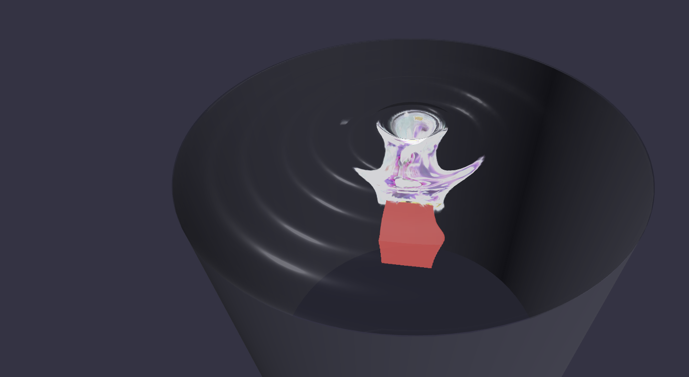

# Holo Card Prototype
<div align=center>
  
</div>

A Three.js + Vite prototype that renders a warpable scene that may contain both mesh and Gaussian Splats.

## Requirements

- Linux, macOS, or Windows
- Node.js **20+** (LTS recommended)
- npm (comes with Node.js)
- A WebGL2-capable GPU/browser

## Environment Setup

1. Go to the project folder:

```bash
cd /home/ubuntu/nerfstudio/prototype
```

2. Install dependencies:

```bash
npm install
```

## Run in Development Mode

Start the Vite dev server:

```bash
npm run dev
```

Then open the local URL shown in the terminal (usually `http://localhost:5173`).

## Build for Production

```bash
npm run build
```

The build output is generated in the `dist/` folder.

## Preview Production Build

```bash
npm run preview
```

Then open the preview URL printed in the terminal.

## Notes

- Main app entry: `src/main.js`
- Static assets are served from `public/`
- If rendering looks slow, lower render target resolution or disable heavy effects first.
